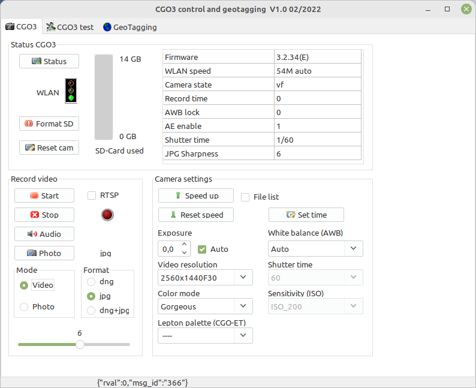
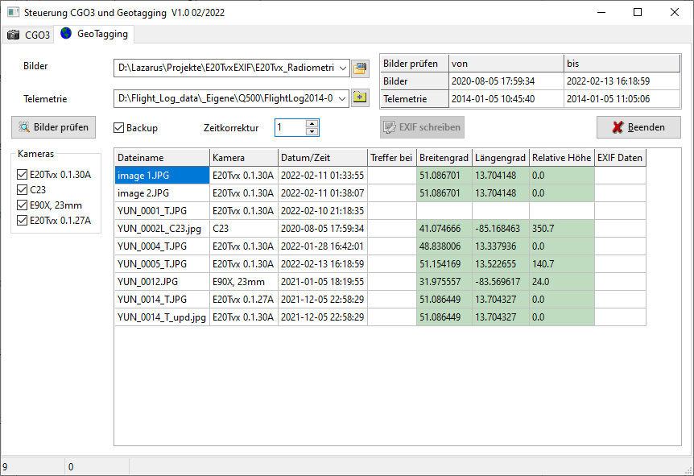

# CGO3control
This application belongs to the tool-set of Q500log2kml. It was exported from this to this extra tool in order to reduce complexity for usage.
 
Important note: Use this application on your own risk. There is no guaranty for correctness and/or completeness of the used data.
Because this all was done by own tests and private researches, the interpretation of the data may be wrong.
On the other hand, this application is freeware.

Features (short description, more - see documentation):
- CGO3 control: A simple GUI to control the camera by CGI commands via HTTP.
- CGO3 test: Test environment for commands to CGO3 via 5G WLAN connection.
- GeoTagging: Add coordinates and altitude from telemetry files to meta data of JPG-pictures from CGO3 that do not have this in EXIF meta. Assignment of data to pictures is based on time stamp.
      

